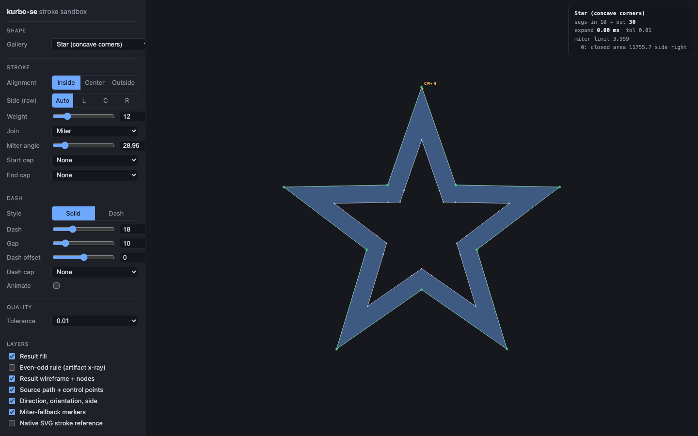
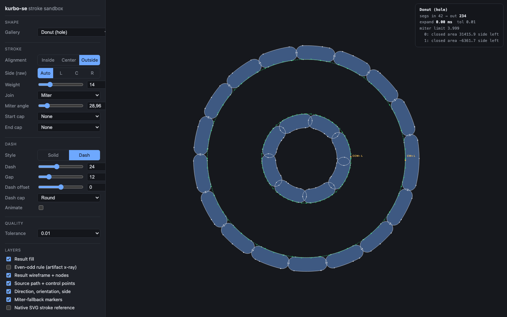
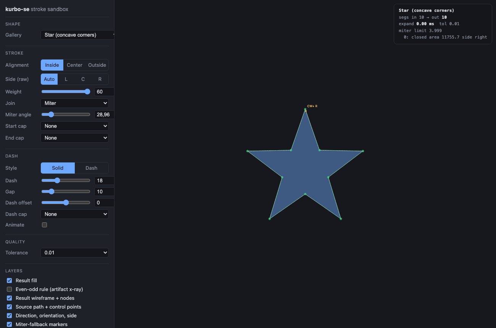
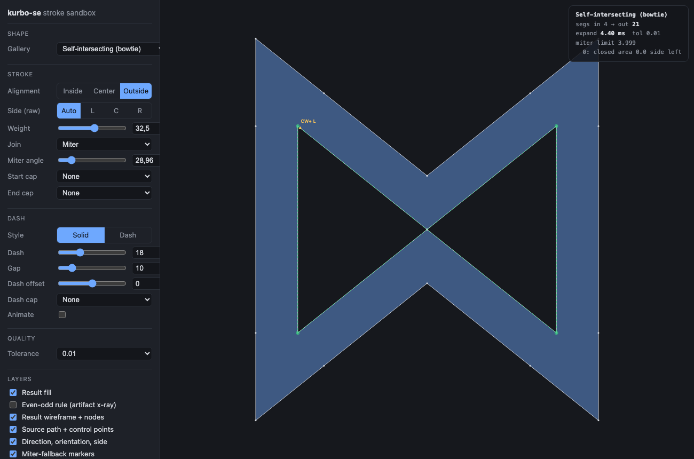
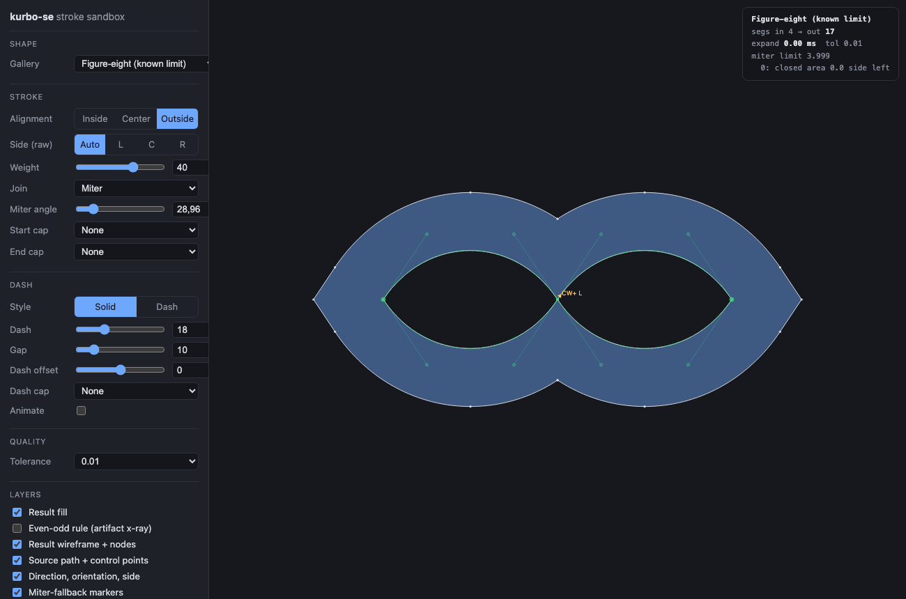
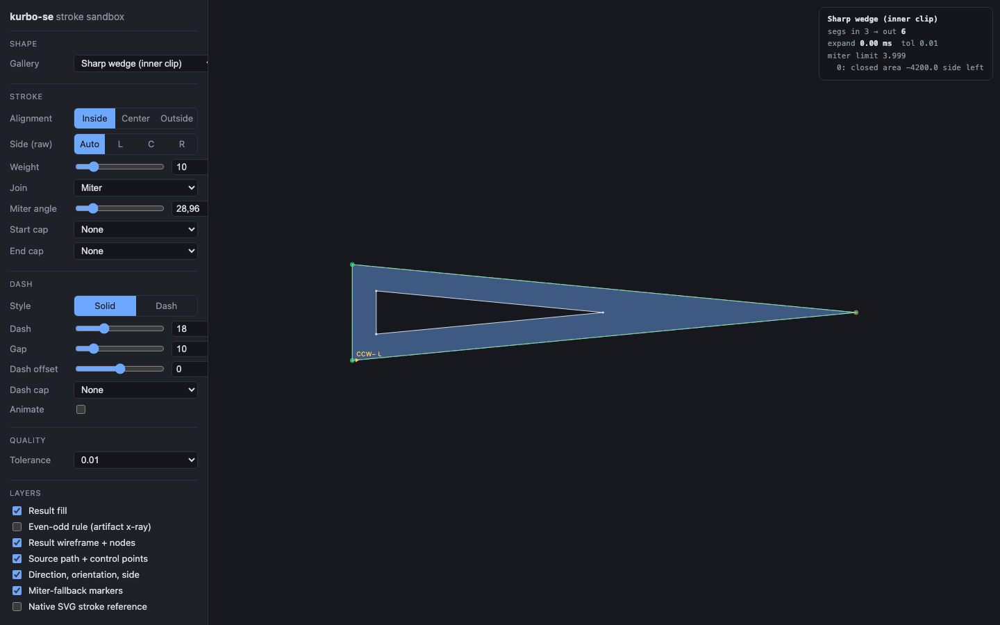
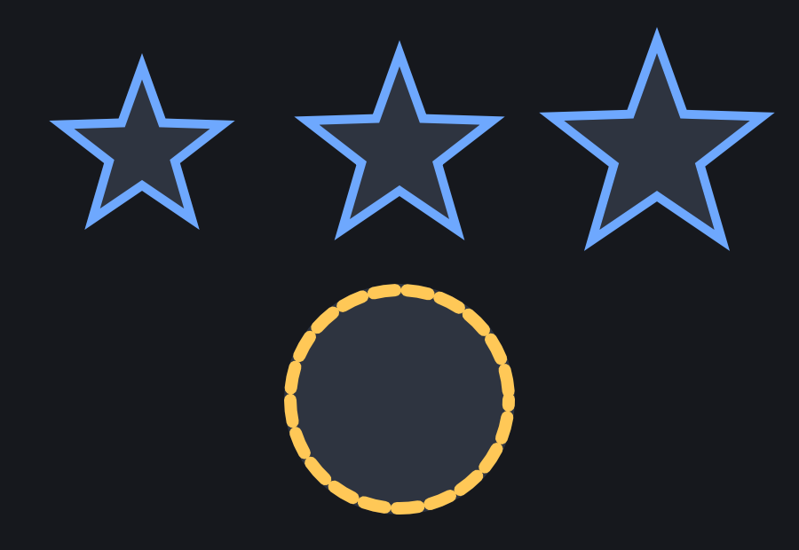

# kurbo-se — stroke extensions for kurbo

Figma-grade stroke features on top of [kurbo]'s public API: **stroke
alignment** (inside / center / outside), independent start/end caps, dash
caps, and dashed aligned strokes — produced as fill outlines.

**One extra dependency, no patching.** kurbo-se is *not* a fork: it depends
on unmodified kurbo from crates.io and re-exports it (`kurbo_se::kurbo`), so
its `BezPath` is the same type your renderer already consumes. If you use
[vello], the output feeds `Scene::fill` directly.

By [Nursultan Akim](https://github.com/ninsent) ·
[github.com/ninsent/kurbo-se](https://github.com/ninsent/kurbo-se)

```rust
use kurbo_se::{StrokeStyle, StrokeAlignment, stroke_aligned};
use kurbo_se::kurbo::{Rect, Shape};

let shape = Rect::new(0.0, 0.0, 100.0, 60.0);
let style = StrokeStyle::new(8.0).with_alignment(StrokeAlignment::Inside);
let outline = stroke_aligned(shape, &style, 0.1);
// Fill `outline` with the NONZERO winding rule.
```

| | | |
|---|---|---|
|  |  |  |
| inside-aligned, miter | donut, outside + dashed, round dash caps | past the local thickness the inside stroke saturates |
|  |  |  |
| self-intersecting: outside never enters the fill | crossing lobes merge into one outside band | a thin wedge fills solid |

## Feature scope (mirrors Figma's stroke panel)

| Parameter | Values | Notes |
|---|---|---|
| `width` | `f64 ≥ 0` | `0` → empty path; negative/non-finite → empty (+ `debug_assert`) |
| `alignment` | `Center` \| `Inside` \| `Outside` | per-subpath resolution, hole-aware (see below) |
| `side` | `Option<Left \| Center \| Right>` | raw geometric override, bypasses alignment |
| `join` | `kurbo::Join` (Miter/Bevel/Round) | reused, not redefined |
| `miter_angle` | `0..=180` degrees | corner angle at or below which miters bevel; `limit = 1/sin(angle/2)` (conversions exported) |
| `start_cap`/`end_cap` | `kurbo::Cap` (Butt/Round/Square) | independent per end, open subpaths |
| `dash.pattern` | arbitrary `&[f64]` | odd lengths behave doubled (SVG); invalid patterns (negative/NaN/zero-sum) render solid instead of panicking |
| `dash.offset` | any finite `f64` | normalized like `stroke-dashoffset`; animating it is a first-class use case |
| `dash.cap` | `kurbo::Cap` | for dash-created edges; true endpoints keep start/end caps; zero-length dashes render as dots (Round/Square) |
| `tolerance` | `f64` | plumbed everywhere, including join/cap arcs; `0.25` is a good display value |

Width profiles are out of scope.

## Semantics

- **Output contract:** a fill outline for the **nonzero winding rule**. The
  outline self-overlaps by design (inner joins, cusps, 180° turns); nonzero
  cancels the overlaps. Even-odd will show artifacts.
- **Conventions:** Y-down coordinates; the unit normal `t̂.turn_90()` points
  right of travel; positive signed area = clockwise (kurbo's convention).
- **Closed contours are set-defined**, matching Figma:
  `Inside(w) = { p ∈ F : dist(p, path) ≤ w }` and
  `Outside(w) = { p ∉ F : dist(p, path) ≤ w }`, with `F` the filled region
  of the whole path. So an inside stroke never leaves the fill and an
  outside stroke never enters it — at *any* width — and a width beyond the
  local thickness **saturates**: the shape fills completely instead of the
  band folding over itself.
- **Holes and compounds:** a donut's hole strokes *into the ring*, not into
  the void; opposite-winding and reversed subpaths all behave, and drawing
  direction never changes what `Inside` looks like.
- **Self-intersecting contours** (bowtie, figure-eight) are split at their
  crossings and each lobe resolves against the fill separately.
- **Open subpaths:** inside/outside is geometrically undefined; kurbo-se
  maps `Inside → Right`, `Outside → Left` of the travel direction (the
  SVG Strokes draft's suggested aliasing) and lets you set `side`
  explicitly.
- **Dashing order:** the side is resolved from the undashed subpath, dashes
  are cut from the original centerline (lengths never distort with
  alignment), then each dash is expanded independently. Closed contours
  seam-merge (a dash across the seam stays one piece), so animating
  `dash.offset` never pops.
- **Exact shared boundary:** for one-sided strokes, the boundary at
  distance 0 *is* the source path, element for element — an inside stroke's
  outer edge cannot drift off the shape.

## Performance

Measured on an Apple-silicon laptop, tolerance 0.25 (criterion, release):

| Case | time |
|---|---|
| 10-point star (lines), inside, solid | 7.0 µs |
| circle (62 segs), center, solid | 13.5 µs (kurbo's native stroker: 12.6 µs) |
| circle (62 segs), inside, solid | 46 µs |
| circle, inside, dashed + round dash caps | 30 µs |
| 40-cubic wavy path, inside, solid | 120 µs |
| 40-cubic wavy path, inside, dashed | 154 µs |

Centered strokes take a direct path and cost about the same as kurbo's own
stroker. One-sided strokes pay for the region construction (offsetting,
cutting at intersections, pruning, stitching); polylines — the common UI
case — stay in the single-digit microseconds.

Re-expanding per frame (e.g. animating `dash.offset`) is the supported
model — no caching layer needed. Use [`stroke_aligned_with`] with a reused
[`AlignedStrokeCtx`] to keep the hot path allocation-free, mirroring
kurbo's own `StrokeCtx` pattern.

## Renderer integration

kurbo-se does CPU-side expansion; so does vello for every dashed stroke
(see *GPU-friendly Stroke Expansion*, §9.3). `examples/vello-demo` renders
inside/center/outside stars plus an animated dashed ring headlessly:



Measured there: 120 frames at 900×620, scene build *including all stroke
expansion* averages **0.034 ms**; the full GPU frame averages 1.6 ms. For
plain centered solid strokes you can skip kurbo-se at render time:
`kurbo::Stroke::from(&style)` converts (lossily — alignment and dash caps
have no kurbo equivalent; documented on the impl).

## Relationship to kurbo

kurbo-se **reuses** kurbo's public machinery — `offset_cubic` (the
error-controlled, cusp-aware offsetter), `dash`, `Arc`, `Join`/`Cap`,
subpath plumbing — and **reimplements** what is private: join/cap emission,
generalized from kurbo's symmetric stroker to independent per-side
distances, plus robust endpoint tangents and collinear-cubic handling. The
geometry conventions match kurbo's exactly. kurbo is dual-licensed
Apache-2.0/MIT by the Kurbo Authors; this crate follows both the license
and, gratefully, the design.

## Known limitations (honest corner)

- **Boundary band:** classification within roughly one tolerance of
  `dist = w` is approximate — the offset curve, the flattened distance
  index and the cut positions each carry tolerance-scale error. Region
  membership is exact everywhere else.
- **Interleaved self-intersections:** a contour whose crossings nest
  irregularly (a pretzel) decomposes only partially into lobes; the result
  is still finite, contained and artifact-reduced, but the lobe split is
  not guaranteed minimal.
- **Overlapping lobes of one contour:** if a self-intersecting contour
  overlaps itself so the fill winds twice, the erosion inside the
  double-wound part may still paint.
- **Dashed strokes at extreme widths:** dashes are expanded as open bands
  (each dash gets its own caps), so they do not saturate the way solid
  closed contours do.
- **Dash phase per subpath:** the pattern restarts at each subpath
  (kurbo/`stroke_with` semantics); browsers continue it across subpaths.
- Raw `Shape::area` on stroke outlines over-counts self-overlap pockets;
  measure regions by winding, not by summed signed area.

## Sandbox

`sandbox/` hosts an interactive wasm playground (Vite + plain SVG) with a
Figma-style panel, a gallery of pathological shapes, debug layers
(even-odd x-ray, direction/orientation badges, miter-fallback markers) and
a native-SVG reference overlay as a center-stroke oracle. See
[sandbox/README.md](sandbox/README.md).

## Features

- `std` *(default)* — float functions from the standard library.
- `libm` — `no_std` support (an allocator is still required).
- `serde` — Serialize/Deserialize for the style types.

MSRV: Rust 1.85. No `unsafe`.

## Credits

Written by **Nursultan Akim** — <contact@nursultan.me> ·
<https://github.com/ninsent/kurbo-se>

Built on [kurbo] by Raph Levien and the Kurbo Authors, whose offset engine,
dashing and path plumbing do the heavy lifting here, and whose geometric
conventions this crate follows exactly.

## License

Licensed under either of

- Apache License, Version 2.0 ([LICENSE-APACHE](LICENSE-APACHE) or
  <http://www.apache.org/licenses/LICENSE-2.0>)
- MIT license ([LICENSE-MIT](LICENSE-MIT) or
  <http://opensource.org/licenses/MIT>)

at your option — the same dual licence as kurbo.

Unless you explicitly state otherwise, any contribution intentionally
submitted for inclusion in this crate by you, as defined in the Apache-2.0
licence, shall be dual licensed as above, without any additional terms or
conditions.

[kurbo]: https://github.com/linebender/kurbo
[vello]: https://github.com/linebender/vello
[`stroke_aligned_with`]: https://docs.rs/kurbo-se/latest/kurbo_se/fn.stroke_aligned_with.html
[`AlignedStrokeCtx`]: https://docs.rs/kurbo-se/latest/kurbo_se/struct.AlignedStrokeCtx.html
